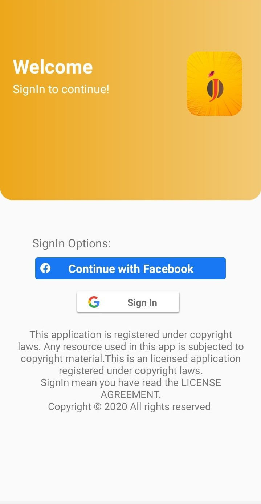
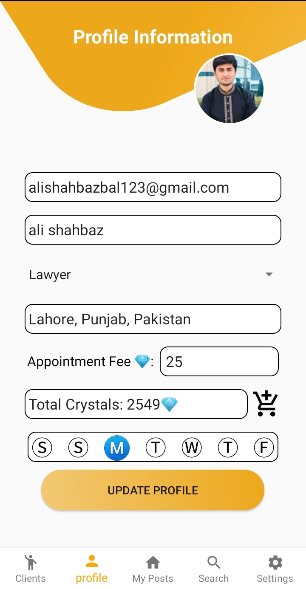
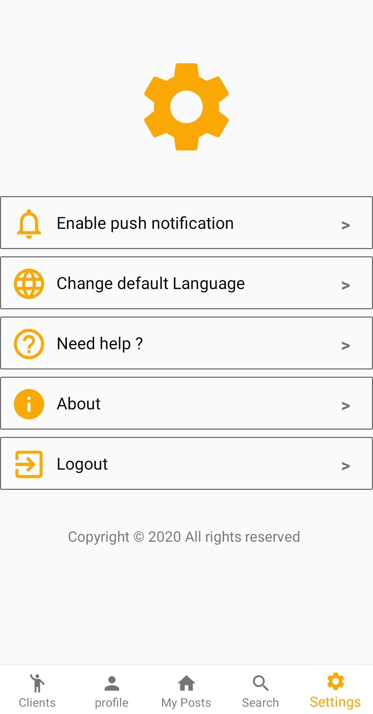

# Jimme
Schedule your appointments in seconds

This is a mobile application that allows users to schedule appointments for various positions such as doctors, psychiatrists, etc. The application is designed to make it easy for users to connect with professionals who are available for appointments.

## Technologies Used
- Language: Java
- Rest Client: RestAPI, OkHttp
- Async: Async Task
- Local Database: Sqlite
- Payment Gateway: PayPal

## Features
- Users can search for available professionals by their field of expertise, location, and availability times
- Professionals can set their availability times, and users can take appointments accordingly
- Users can schedule, reschedule or cancel appointments based on availability
- Payment gateway integration with PayPal to pay the fee for the appointments
- User can view their appointment history and upcoming appointments
- Push notification for appointment reminders

## Screenshots
    

   

## Installation
1. Clone the repository
2. Open the project in Android Studio
3. Run the application on an emulator or physical device

## Usage
1. Sign up and login to the application
2. Search for available professionals
3. Schedule an appointment by selecting the professional and available time slot
4. Proceed with payment using PayPal
5. View upcoming appointments in the appointment history tab
6. Cancel or reschedule appointments as needed
